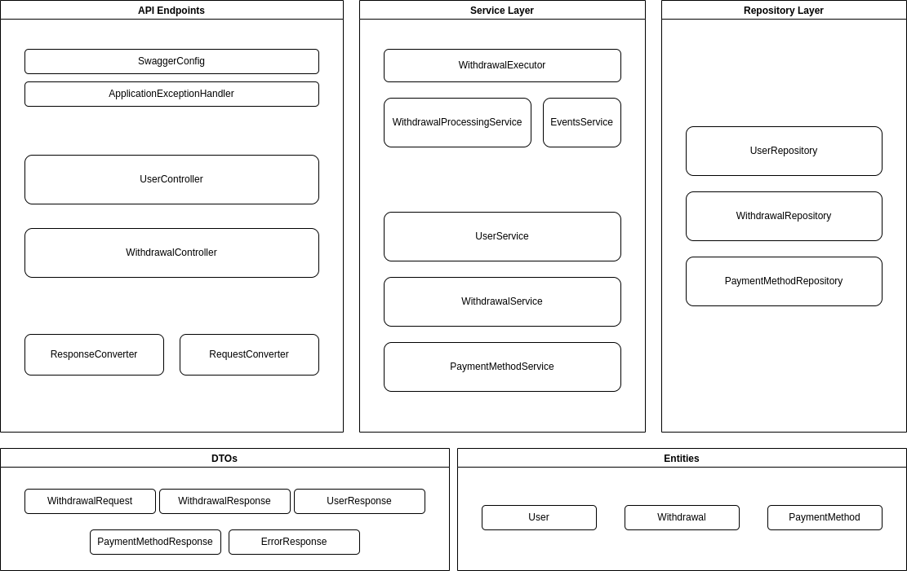

# Withdrawal Service



## How to Test the API

Start the application and access the following URL
`http://localhost:7070/swagger-ui/`

## How to Run the Service

You have to build the container by executing the following command.

```shell
docker build --platform linux/amd64 -t wezaam-challenge .
```

You have to start the container by executing the following command.

```shell
docker run -p 8080:8080 -t wezaam-challenge
```

## Others

I have separated the registering process of all the withdrawals. The end user is going to receive a withdrawal id that
has to be used to retrieve the status later on. The registered withdrawals are executed asynchronously based on
executedAt field. 